# ABS Player: an Audiobookshelf client for the ESP32-S3 round display

A small, self-contained audiobook player that streams from an
[Audiobookshelf](https://www.audiobookshelf.org/) server over Wi-Fi and plays through the board's
built-in speaker. It browses your library on a 1.85" round touchscreen, resumes where you left
off, and syncs listening progress back to the server, so you can move between this and the
Audiobookshelf apps.

> **Disclaimer:** this project was created with [Claude Code](https://claude.com/claude-code),
> Anthropic's AI coding agent. Claude worked directly against the hardware from the terminal,
> using ESP-IDF to build, flash and read the serial logs, and used those logs to debug the board
> bring-up, audio pipeline and UI. The code has only been tested on the one board described below;
> review it before relying on it.

## The idea

Audiobookshelf is a self-hosted server for audiobooks. Its clients are phone and web apps, but
a tiny dedicated player (a round screen with a speaker, sitting on a desk or bedside table) is
nicer for "just carry on with my book". This firmware turns an inexpensive dev board into that:

- **Home:** "Continue Listening", "Recently Added" and "Downloaded" shelves of cover art. Swipe
  left/right on the covers to browse; switch shelf with the arrows (or a swipe) on the shelf name
  at the bottom, where dots show which shelf you're on.
- **Library:** Covers, Books (A-Z list) and Authors, switched with the same bottom pill as Home,
  with an A-Z scrub ring on the right edge. A Settings view there shows library, Wi-Fi and SD
  card info, refreshes the library, and switches between the server's libraries.
- **Podcasts:** podcast libraries work too. Shows appear like books; tapping one lists its
  episodes (in progress first, then newest), and episodes play, resume and sync progress like
  books.
- **Now Playing:** cover art backdrop, two side arcs (right: chapter progress, drag to scrub;
  left: volume, drag to set), ±30 s and previous/next chapter. When nothing is loaded it offers your most recent book to
  resume.
- **Status row:** battery (on battery: an icon filled to the level and the percentage; charging:
  a green outline with a bolt inside and "Chrg"; charged: solid green and "Full"), Wi-Fi, and
  Bluetooth (not enabled yet, so it always shows as off).
- **Book details** (long-press any book, or tap the title on Now Playing): play, and download to /
  remove from the SD card.
- **SD card (optional):** caches the library and cover art for instant start-up and offline
  browsing, and holds downloaded books for offline listening. Progress made offline is pushed
  to the server the next time it's reachable. Downloaded books also get a "Downloaded" shelf on
  Home.

## Screenshots

Captured on the device itself (see [Capturing screenshots](#capturing-screenshots)).

| Home | Library | Now Playing |
| :---: | :---: | :---: |
| 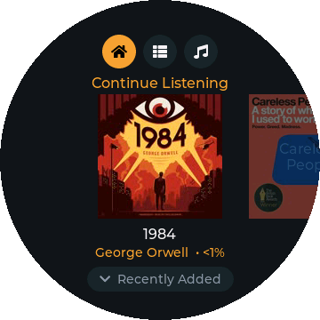 | 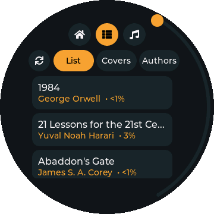 | 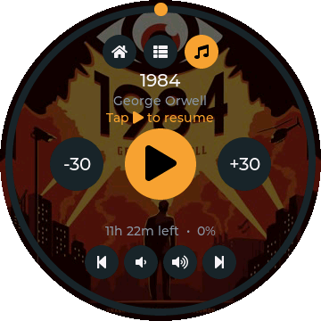 |
| 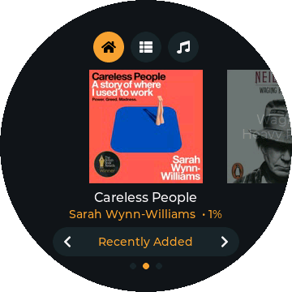 | 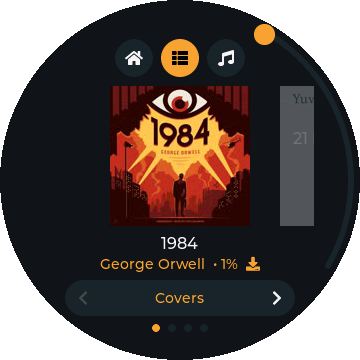 | 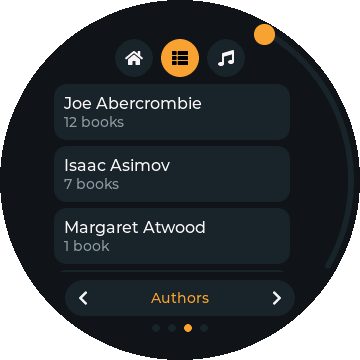 |

| Browsing covers | Resuming a book |
| :---: | :---: |
| 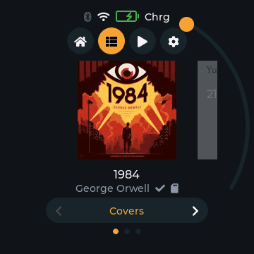 | 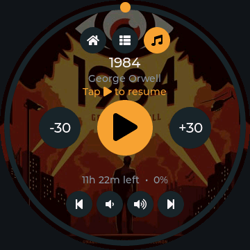 |

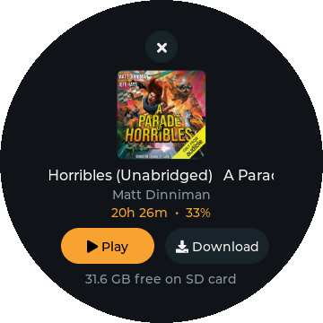
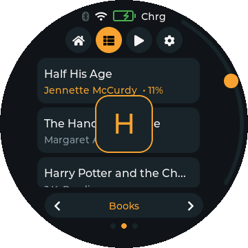

Dragging the ring on the Library page's right edge jumps through the list A-Z, with the current
letter shown large. Long-pressing a book opens its details, where it can be downloaded to the SD
card.
<br clear="right">

## Hardware

**[Waveshare ESP32-S3-Touch-LCD-1.85C](https://docs.waveshare.com/ESP32-S3-Touch-LCD-1.85C)**, **V1 revision**:

| Part | Details |
| --- | --- |
| SoC | ESP32-S3R8, dual-core 240 MHz, Wi-Fi |
| Memory | 8 MB octal PSRAM, 16 MB flash |
| Display | 1.85" round 360×360 IPS, ST77916 over QSPI |
| Touch | CST816T capacitive (I2C) |
| Storage | microSD slot (1-bit SDMMC), optional |
| Audio | PCM5101 I2S DAC + NS8002 amplifier, onboard speaker |
| IO expander | TCA9554 (LCD/touch resets, amp enable) |

Pin assignments used (see `main/board.c`):

| Function | GPIO |
| --- | --- |
| I2C SDA / SCL (touch, expander, RTC) | 11 / 10 |
| LCD QSPI SCK, D0–D3, CS | 40, 46, 45, 42, 41, 21 |
| LCD backlight (PWM) | 5 |
| Touch interrupt | 4 |
| I2S BCK / LRCK / DOUT (to PCM5101) | 48 / 38 / 47 |
| LCD reset, touch reset | expander pins EXIO2, EXIO1 |
| microSD CLK / CMD / D0 | 14 / 17 / 16 |

**Board revisions matter.** Waveshare ships two audio variants of this board. V2 has an ES8311
codec and ES7210 microphone ADC on I2C, and Waveshare's demo code targets it. V1, which this
firmware targets, has a PCM5101 DAC with no control bus, so volume is applied in software. If
your I2C scan shows devices at 0x18/0x40 you have V2, and `board_audio_*` in `main/board.c`
needs porting to the ES8311.

## How playback works

Most audiobooks in a typical library are large single-file `.m4b` (AAC) files, often 20–40
hours long. Their MP4 index tables run to megabytes, which makes seeking into them directly on a
microcontroller impractical. Instead the player uses Audiobookshelf's HLS transcode mode:

1. `POST /api/items/:id/play` advertises only `audio/mpeg` with `forceTranscode`, so the server
   serves every book, whatever its format, as HLS: 6-second MPEG-TS segments named
   `output-N.ts`, containing AAC (or MP3 for MP3 sources, stream-copied).
2. Segment N always starts at N×6 s, even after the server restarts its transcoder for a seek.
   This was verified: a segment is byte-identical whichever way it was produced. So the playlist
   is never downloaded: to play from time *t*, the player fetches segments from ⌊t/6⌋ and
   drops the first (t mod 6) seconds of decoded audio.
3. A **fetch task** streams segments over a keep-alive HTTPS connection into a 512 KB PSRAM
   buffer (about a minute of audio). A **decode task** feeds it through `esp_audio_codec`'s TS
   demuxer and AAC/MP3 decoder to I2S. A **control task** handles commands, the playback
   session, and progress sync (every 20 s, and on pause, seek and close).

Cover art is downloaded already resized by the server, decoded with the ESP32-S3's ROM JPEG
decoder, and held in an LRU cache in PSRAM (and on the SD card when one is fitted).

### SD card: caching and downloads

With a FAT-formatted microSD card inserted (it is never formatted by the firmware), everything
lives under `/sdcard/abs/`. Each library has its own cache folder, so switching libraries never
overwrites another's cache; downloads are keyed by item id, which is unique across the server.

| Path | Contents |
| --- | --- |
| `libraries.json`, `me.json` | The server's libraries and the user's progress (shared by all libraries). |
| `lib/<library id>/items.json` | That library's last item list. Shown at boot before Wi-Fi is up, then refreshed. |
| `lib/<library id>/covers/<id>_<size>.jpg` | Cover JPEGs as downloaded; read back in ~45 ms instead of a network round trip. |
| `lib/<library id>/episodes/<id>.json` | A podcast's episode list with progress, for browsing offline. |
| `dl/<id>/audio.ts` | A downloaded book: its HLS segments appended in order. |
| `dl/<id>/index.bin` | End offset of each completed segment (so seeking is one lookup). |
| `dl/<id>/meta.json` | Duration and chapters, for playback without the server. |
| `dl/<id>/progress.json` | Local listening position, and whether the server still needs it. |

**Downloads** fetch the same transcoded segments the player streams, using a separate
playback session (with its own device ID so it never collides with playback), and run in the
background one at a time. A 1-hour book takes about 2 minutes. Index entries are written only
after the audio is synced to the card, so a download interrupted by a reboot or power loss
resumes from the last complete segment. Removing a download cancels it if needed and deletes it
in the background.

**Playing a downloaded book** reads `audio.ts` from the card through the same decoder as
streaming, with no server session. Progress is saved to `progress.json` every 20 seconds (and on
pause, seek and stop) and sent with `PATCH /api/me/progress/:id` whenever Wi-Fi is up. Positions
saved while offline are pushed at the next library load, and they take priority over the
server's older value.

## Project layout

```
main/
  main.c           startup: display, Wi-Fi, library load, refresh loop
  board.c/.h       hardware bring-up: I2C, expander, QSPI LCD, touch, backlight, I2S audio
  wifi.c/.h        station mode, plus the setup access point, scan and test-join
  config.c/.h      saved settings (Wi-Fi, server, sign-in tokens) in NVS
  portal.c/.h      setup portal: access point, DNS catch-all, web server, apply-and-restart
  portal_page.h    the setup web page (self-contained HTML/JS)
  ui_setup.c       on-screen setup: QR code to join, progress of a save
  abs_api.c/.h     Audiobookshelf REST client (library, progress, sessions, covers, HLS segments)
  player.c/.h      streaming player: fetch / decode / control tasks
  catalog.c/.h     selected library, per-library SD cache, loading from cache or server
  cover.c/.h       cover download (SD-cached), JPEG decode and PSRAM LRU cache
  storage.c/.h     SD card mount and safe file helpers
  download.c/.h    background book downloads and offline progress
  carousel.c/.h    reusable virtual cover carousel (3 card objects, any number of books)
  ui.c, ui_priv.h  UI shell: dock, pages, shared helpers, derived book lists
  ui_home.c        Home shelves
  ui_library.c     Library list / covers / authors + A-Z ring
  ui_player.c      Now Playing
  ui_sheet.c       book details sheet (play / download / remove)
  ui_episodes.c    podcast episode list
  ui_settings.c    Settings view and library picker
  switcher.c/.h    bottom "< Name >" pill shared by Home and Library
  lv_mem_psram.c   LVGL allocator that keeps all UI objects in PSRAM
```

## Building and flashing

Requires [ESP-IDF](https://docs.espressif.com/projects/esp-idf/) **v5.5** (developed on 5.5.2).
Managed components (LVGL 9.3, esp_lvgl_port, ST77916/CST816S drivers, esp_audio_codec, esp_jpeg)
are fetched automatically on the first build.

```sh
. $IDF_PATH/export.sh
idf.py set-target esp32s3     # first time only
idf.py -p /dev/tty.usbmodem1101 flash monitor
```

On macOS, if `export.sh` picks a Python that doesn't have the IDF virtualenv, point it at the
right one first, e.g. `export IDF_PYTHON_ENV_PATH=~/.espressif/python_env/idf5.5_py3.14_env`.

No credentials are built into the firmware. On first boot the device starts in setup mode; connect
from a phone to enter your Wi-Fi and Audiobookshelf details (see [Setup portal](#setup-portal)).
Settings are kept in NVS, so reflashing doesn't lose them (`idf.py erase-flash` does).

The console is on the board's native USB (USB-Serial/JTAG).

## Notes and lessons from bring-up

- **Internal RAM is the real constraint, not PSRAM.** Wi-Fi, TLS, DMA buffers and task stacks all
  compete for ~512 KB of on-chip SRAM. LVGL uses a custom allocator (`lv_mem_psram.c`) so every UI
  object lives in PSRAM. That took free internal RAM from ~14 KB to ~41 KB. Covers, the audio
  buffer, JSON parsing and the cover loader's stack are also in PSRAM.
- **SD card and PSRAM don't mix:** the SDMMC controller's DMA corrupts data going to or from
  PSRAM buffers. File data therefore goes through a small internal-RAM bounce buffer
  (`storage.c`), and `CONFIG_FATFS_VFS_FSTAT_BLKSIZE` is left at 0: a 4 KB stdio buffer would be
  allocated in PSRAM and silently scramble files.
- **Power saving:** with no buttons, touch is the only way in. After a period without a touch the
  screen dims and then turns off (panel asleep, LVGL paused, CPU allowed down to 80 MHz); audio
  keeps playing, and the next touch wakes the screen without pressing anything. With the screen
  off, nothing playing or downloading and no USB host attached, the device deep-sleeps; a touch
  (the CST816 pulls its INT line, GPIO4, low) or the BOOT button wakes it, which restarts the
  firmware. Wi-Fi uses modem sleep. Brightness and both timeouts are in Settings.
- **Battery:** the charge level is read on GPIO8 (1:3 divider) and mapped through a typical LiPo
  curve. The charger's status pin only drives its LED and USB power isn't wired to a GPIO, so
  charging is inferred: a USB host on the ESP32's own USB port means external power; otherwise
  the voltage jumping up or down (plug/unplug) or its 3-minute trend decides. A plain wall charger
  is only detected through the voltage. Full charge is inferred as well: the charger holds ~4.2 V
  while charging and then stops, leaving the cell flat a little lower, so "charged" appears after
  about 3 minutes of flat readings on power.
- **Touch:** the CST816T powers up with continuous swipe tracking disabled (MotionMask `0xEC` =
  0), which breaks gestures. `board.c` sets it to `0x06`.
- **Display:** panels that report ID `00 02 7F 7F` need Waveshare's alternate ST77916 init
  table, which is selected automatically.
- **Touch zones:** the progress and A-Z rings claim every touch from their inner edge (~166 px
  from centre) outwards, so all controls are kept inside radius ~150–160 px (see `ui_priv.h`).
- **Server:** some reverse proxies reject default HTTP user agents, so the client sends its own.
- **Debugging aids:** define `PLAYER_STATUS_LOG` (e.g. with `target_compile_definitions` in
  `main/CMakeLists.txt`) to log pipeline stats every second: input rate, decode errors, I2S timing,
  underruns, a loudness envelope and free heap. `PLAYER_NO_SYNC` disables progress sync for tests.

## Capturing screenshots

The screenshots and GIFs above come from the device itself. Build with `UI_CAPTURE` (and
`PLAYER_NO_SYNC`, so the demo playback doesn't move your real progress) by adding this to
`main/CMakeLists.txt`:

```cmake
target_compile_definitions(${COMPONENT_LIB} PRIVATE UI_CAPTURE PLAYER_NO_SYNC)
```

After the library loads, `main/ui_capture.c` runs a scripted tour of the UI and streams each frame
over the console as base64 RGB565. LVGL's clock is replaced by a virtual one that only advances when
the script says so, so animation frames land at exact moments even though each frame takes a
second or two to send. Record the console to a file, then convert it:

```sh
python3 tools/capture_to_media.py serial.log docs/media   # needs ffmpeg
```

Frames named `<name>_NNN` become `<name>.gif` (using each frame's hold time); the rest become PNGs
masked to the round panel. Note that the capture shows your own library's titles and covers.

## Setup portal

With no saved configuration, or from **Settings → Wi-Fi & login**, the device starts its own
Wi-Fi network and shows how to reach it:

<p align="center">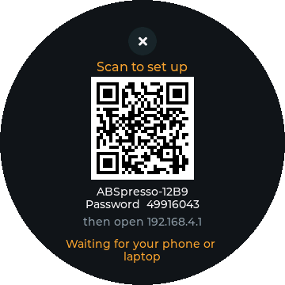</p>

1. Scan the QR code with a phone camera (or join `ABS-Player-XXXX` with the password shown).
   The network uses WPA2 with a fresh random password each time.
2. The setup page usually opens by itself (captive portal); otherwise browse to
   `http://192.168.4.1`.
3. Pick your Wi-Fi network, enter the server address, and sign in with your
   **Audiobookshelf username and password** (no API key needed) or paste an API key.
   Device preferences are on the same page: brightness, screen-off and sleep timers, skip
   back/forward lengths, and 180° rotation.
4. **Save & connect** tests the Wi-Fi join and the sign-in first and reports any problem on the
   page and the screen. Nothing is saved until both work. Then it saves and restarts.

Username sign-in stores the session's access and refresh tokens (never your password). The
device renews the access token when the server rejects it, and asks you to sign in again if the
refresh token has expired too. Blank password fields keep the saved Wi-Fi password or sign-in.

## Known limitations

- Fonts cover basic Latin only, so accented characters in titles don't render.
- One cover format (JPEG with unusual 1×2 chroma subsampling) isn't supported by the ROM decoder
  and falls back to a title card.
- The first library load and first cover take a few seconds (TLS handshakes) when nothing is
  cached on the SD card yet.
- Podcast episodes can't be downloaded yet (books can). Very long feeds show their first 150
  episodes (in-progress and newest).
- Listening to a downloaded book updates your progress but isn't recorded as a listening session
  in the server's stats.
- Cached covers aren't refreshed if you change a book's cover on the server (delete
  `/sdcard/abs/covers` to reset). Downloads have no overall storage cap beyond the card's free space.
